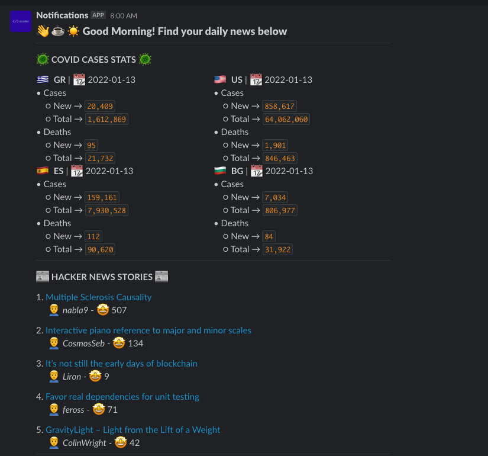

# With Coffee

The personal newsletter you read with your morning coffee ☕️. A simple tool that daily fetches and sends them directly to slack:
1. Covid cases data
2. Weather forecast
3. Top Stories from [hackernews](https://news.ycombinator.com/)

## 🌉 One Picture A Thousand Words

## ⚙️ Configuration

You can use the below configuration to personalize what the tool delivers to slack.

Variable | Default | Description
---------|---------|------------
`COVID_API_BASE_URL` | [link](https://covid19.richdataservices.com/rds/api/query/int/jhu_country/select) | This was added in case the base url will changed from the other side. The data structure is more or less hard coded.
`COVID_COUNTRIES` | `GR` | Comma seperated list of [iso3166](https://en.wikipedia.org/wiki/ISO_3166-1_alpha-2) country codes to fetch data.
`MONGO_CONNECTION_STRING` | No default but **required** | The connection string for the mongo cluster to cache data. *I plan to make this optional*
`MONGO_DATABASE` | `news` | The database to cache the data
`SLACK_TOKEN` | - | **Required**. The slack app token to post to slack.
`SLACK_CHANNEL` | `news` | The channel to post the newsletter on slack. Make sure it exists!
`HACKERNEWS_BASE_URL` | [hn firebase](https://hacker-news.firebaseio.com/v0") | The base url to fetch hackenews posts
`HACKERNEWS_STORIES_LIMIT` | 5 | Amount hackenews stories to pull.
`WEATHER_BASE_URL` | [WeatherApi](https://www.weatherapi.com/) | The base url of the weather api. [WeatherApi](https://www.weatherapi.com/) is used
`WEATHER_LOCATIONS` | Thessaloniki | Comma separated list of locations to pull weather forecast for.
`WEATHER_API_TOKEN` | None but **required** | The api token to authenticate to the weather api. Grab one by registering [here](https://www.weatherapi.com/signup.aspx)

## ℹ️ Note

_These are my first steps with golang so a lot of things can be greatly improved or may not make so much sense currently_ 🤷🏽‍♂️

